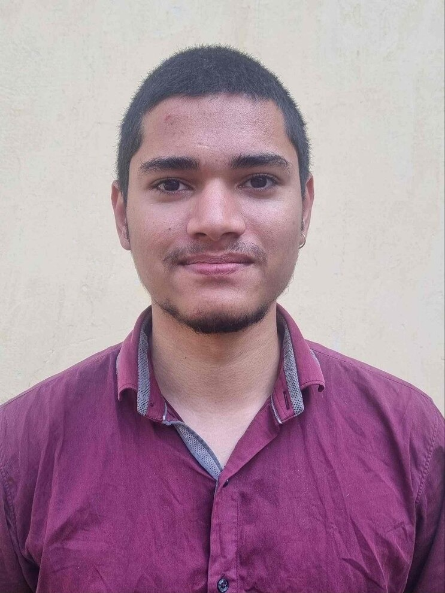

# About the Author

  

    
  

  

    
ARCHITECT &bull; RESEARCHER

    <h2 style="margin: 0; font-size: 2rem; font-family: 'Space Grotesk', sans-serif; font-weight: 800;">Aditya</h2>
    

      B.Sc. Zoology &bull; M.Sc. Geography (Open Univ.) &bull; UPSC Optional: Anthropology &bull; Data Analyst
    

  

## The Journey & Academic Pillars

- **🦴 UPSC Optional Subject: Anthropology:** My chosen optional for the UPSC Civil Services. Blending physical paleoanthropology (primate fossil lineages, hominid skeletal evolution, Mendelian genetics) with socio-cultural ethnography (kinship systems, Indian village structures, tribal welfare policies, and 5th/6th Schedule constitutional safeguards). It bridges biological science directly into public administration and human governance.
- **🌍 M.Sc. in Geography (Open University):** Currently pursuing a Master of Science in Geography. Mastering physical geomorphology, atmospheric circulation systems, climatological oscillations (El Niño/IOD), oceanography, and spatial economic geography across regional and global scales. This equips my research with a planetary geographical canvas.
- **🦎 B.Sc. in Zoology:** Graduated with a foundational degree in Zoology. Deep study of animal taxonomy, comparative vertebrate physiology, cellular bioenergetics, genetics, and ecology provided a rigorous empirical understanding of living, adaptive systems.
- **📊 Data Analytics:** Actively advancing through Data Analytics. Translating qualitative humanities and complex administrative concepts into statistical models, spatial data visualization, and computational simulations.
- **🏛️ The UPSC Living Codex:** Transforming the entire UPSC Civil Services syllabus—spanning cosmic evolution (Big Bang, stellar nucleosynthesis), planetary geology, ancient and modern world history, constitutional law, and macroeconomic policy—into living, interactive simulations right here on **ADVANCED ANALYSIS**.

---

## The "All-or-Nothing" Learning Philosophy

> *"I don't hold casual or superficial interests. But the moment something seizes my curiosity, I don't stop until I understand its fundamental first principles—from the ground up."*

Whether it is compiling a Linux kernel, tracing the thermodynamic pathways of stellar nucleosynthesis, deciphering Ashokan Prakrit inscriptions, or building interactive physics engines in WebGL, my philosophy is absolute depth.

---

## Tools of Curiosity (How I Pass Time)

When I am not deep in UPSC research, data analytics, or coding, you will find me engaging with these disciplines:

1. **🐧 Linux & Systems Engineering:** Tinkering with Linux distributions on my laptop, kernel parameters, shell scripting, and tailoring minimal, ultra-fast computing environments.
2. **🤖 AI-Assisted Mobile OS Customization:** Experimenting with autonomous AI agents to build, modify, and optimize personalized mobile operating system workflows and productivity tooling.
3. **🏃 Morning Road Running:** Daily dawn runs for cardiovascular health, endurance, mental clarity, and maintaining disciplined physical energy.
4. **🎨 Fine Drawing & Sketching:** Hand-sketching biological anatomy, mechanical systems, and visual art to turn abstract thoughts into tangible spatial forms.
5. **📷 Photography & Optics:** Studying lighting, lens optics, focal depth, and capturing candid moments in nature and urban environments.
6. **🧠 Human Nature & Psychology:** Observing social dynamics, reading philosophical literature, deep music listening, and occasional mobile gaming for leisure.

---

## Connect & Community

Join our growing community of researchers, UPSC aspirants, and creative thinkers across these channels:

  <a href="https://www.youtube.com/@ADVANCED_ANALYSIS" target="_blank" rel="noopener noreferrer" class="aa-social-btn youtube" style="display: inline-flex; align-items: center; gap: 8px; padding: 10px 18px; border-radius: 99px; background: rgba(255, 51, 68, 0.12); border: 1px solid rgba(255, 51, 68, 0.35); color: #fff; text-decoration: none; font-weight: 600;">
    <svg width="20" height="20" viewBox="0 0 24 24" fill="currentColor"><path d="M23.498 6.186a3.016 3.016 0 0 0-2.122-2.136C19.505 3.545 12 3.545 12 3.545s-7.505 0-9.377.505A3.017 3.017 0 0 0 .502 6.186C0 8.07 0 12 0 12s0 3.93.502 5.814a3.016 3.016 0 0 0 2.122 2.136c1.871.505 9.376.505 9.376.505s7.505 0 9.377-.505a3.015 3.015 0 0 0 2.122-2.136C24 15.93 24 12 24 12s0-3.93-.502-5.814zM9.545 15.568V8.432L15.818 12l-6.273 3.568z"/></svg>
    YouTube: @ADVANCED_ANALYSIS
  </a>

  <a href="https://t.me/oOlIOo_b0t" target="_blank" rel="noopener noreferrer" class="aa-social-btn telegram" style="display: inline-flex; align-items: center; gap: 8px; padding: 10px 18px; border-radius: 99px; background: rgba(41, 169, 235, 0.12); border: 1px solid rgba(41, 169, 235, 0.35); color: #fff; text-decoration: none; font-weight: 600;">
    <svg width="20" height="20" viewBox="0 0 24 24" fill="currentColor"><path d="M12 0C5.37 0 0 5.37 0 12s5.37 12 12 12 12-5.37 12-12S18.63 0 12 0zm5.56 8.16l-1.92 9.06c-.14.65-.53.81-1.08.5l-2.98-2.2-1.44 1.38c-.16.16-.29.29-.6.29l.21-3.04 5.54-5.01c.24-.21-.05-.33-.38-.12l-6.85 4.31-2.95-.92c-.64-.2-.66-.64.14-.95l11.53-4.45c.53-.19 1 .13.81.95z"/></svg>
    Telegram: @oOlIOo_b0t
  </a>

  <a href="https://www.instagram.com/advanced_analysis?stkn=YjU2Y3Roczh4ZXkw" target="_blank" rel="noopener noreferrer" class="aa-social-btn instagram" style="display: inline-flex; align-items: center; gap: 8px; padding: 10px 18px; border-radius: 99px; background: rgba(225, 48, 108, 0.12); border: 1px solid rgba(225, 48, 108, 0.35); color: #fff; text-decoration: none; font-weight: 600;">
    <svg width="20" height="20" viewBox="0 0 24 24" fill="currentColor"><path d="M12 2.163c3.204 0 3.584.012 4.85.07 3.252.148 4.771 1.691 4.919 4.919.058 1.265.069 1.645.069 4.849 0 3.205-.012 3.584-.069 4.849-.149 3.225-1.664 4.771-4.919 4.919-1.266.058-1.644.07-4.85.07-3.204 0-3.584-.012-4.849-.07-3.26-.149-4.771-1.699-4.919-4.92-.058-1.265-.07-1.644-.07-4.849 0-3.204.013-3.583.07-4.849.149-3.227 1.664-4.771 4.919-4.919 1.266-.057 1.645-.069 4.849-.069zm0-2.163c-3.259 0-3.667.014-4.947.072-4.358.2-6.78 2.618-6.98 6.98-.059 1.281-.073 1.689-.073 4.948 0 3.259.014 3.668.072 4.948.2 4.358 2.618 6.78 6.98 6.98 1.281.058 1.689.072 4.948.072 3.259 0 3.668-.014 4.948-.072 4.354-.2 6.782-2.618 6.979-6.98.059-1.28.073-1.689.073-4.948 0-3.259-.014-3.667-.072-4.947-.196-4.354-2.617-6.78-6.979-6.98-1.281-.059-1.69-.073-4.949-.073zm0 5.838c-3.403 0-6.162 2.759-6.162 6.162s2.759 6.163 6.162 6.163 6.162-2.759 6.162-6.163c0-3.403-2.759-6.162-6.162-6.162zm0 10.162c-2.209 0-4-1.79-4-4 0-2.209 1.791-4 4-4s4 1.791 4 4c0 2.21-1.791 4-4 4zm6.406-11.845c-.796 0-1.441.645-1.441 1.44s.645 1.44 1.441 1.44c.795 0 1.439-.645 1.439-1.44s-.644-1.44-1.439-1.44z"/></svg>
    Instagram: @advanced_analysis
  </a>

