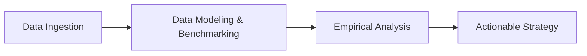

# Research & Analysis

Welcome to the **Research & Analysis** section of **ADVANCED ANALYSIS**.

Here you will find data-backed investigations, performance benchmarks, and deep-dive analytical reports curated by Aditya.

---

## Core Focus Areas

### 1. Empirical Studies
We gather raw performance metrics and telemetry to compare architectures under real-world stress.

### 2. Algorithmic Optimization
Analyzing time/space complexity, resource utilization, and caching strategies.

### 3. Case Studies
Real scenarios evaluating failures, scalability bottlenecks, and engineering decisions.

---

!!! info "Upcoming Research"
    New research publications are released in sync with video breakdowns on our [YouTube Channel](https://www.youtube.com/@ADVANCED_ANALYSIS).
