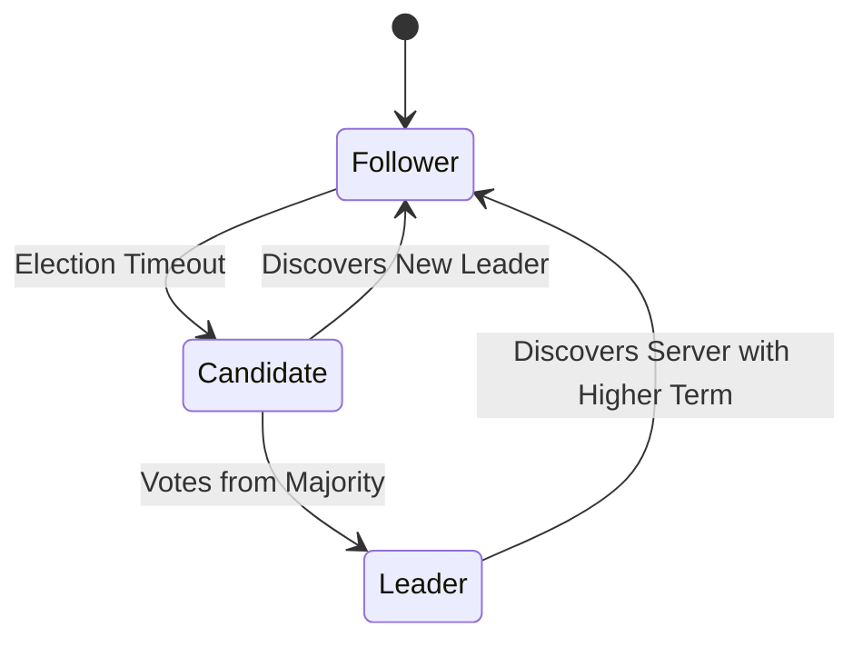

# 📄 Research Papers & Annotated Deconstructions

Curated analyses of classic and state-of-the-art whitepapers in computing, distributed systems, and artificial intelligence.

---

## 1. Attention Is All You Need (2017)
*Authors: Vaswani, Shazeer, Parmar, Uszkoreit, Jones, Gomez, Kaiser, Polosukhin*

### The Breakthrough
Replaced recurrent and convolutional layers entirely with multi-head self-attention mechanisms, drastically reducing training times and scaling sequence modeling.

$$\text{Attention}(Q, K, V) = \text{softmax}\left(\frac{QK^T}{\sqrt{d_k}}\right)V$$

---

## 2. In Search of an Understandable Consensus Algorithm (Raft, 2014)
*Authors: Diego Ongaro and John Ousterhout (Stanford University)*

### Key Architectural Pillars
1. **Leader Election:** Heartbeat timers trigger randomized election timeouts.
2. **Log Replication:** Leaders accept client commands, append to log, and propagate entries.
3. **Safety Invariants:** Only nodes with all committed entries can be elected leader.

